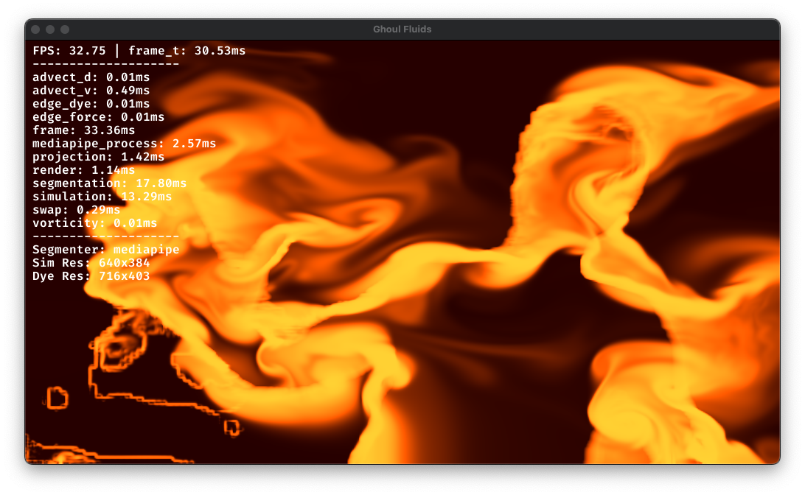

# Ghoul Fluids 👻

Real-time, GPU-driven **stable fluids** that respond to a live **people segmentation mask**.  
Built with **ModernGL + GLFW + OpenCV + MediaPipe**. Optional split-screen shows the camera feed next to the effect — perfect for tuning a Halloween display.

<p align="center">
  
</p>


---

## Features

- **Stable fluids (Stam-style)** on the GPU (advect, vorticity, pressure projection)
- **Edge-based forces** from a live segmentation mask (pushes dye along silhouettes)
- **Split-screen** option: left = camera, right = fluid (`--split`)
- **No giant monolith**: clean module layout, easy to extend
- **Headless tests** (pytest) and **GitHub Actions** CI

---

## How it works

The fluid simulation is based on Jos Stam's stable fluids method, a technique that allows for real-time, unconditionally stable solutions to the Navier-Stokes equations (which describe fluid flow). While a full explanation is out of scope for this README, the key steps are:

1.  **Advection**: Move the fluid's velocity and dye quantities along the existing velocity field.
2.  **External Forces**: Apply forces to the fluid, such as those from the segmentation mask's edges.
3.  **Projection**: This is the crucial step for stability. It makes the velocity field incompressible (divergence-free), meaning the fluid doesn't spontaneously appear or disappear. This is done by solving a Poisson problem for pressure, which is handled on the GPU using a Jacobi solver.

This implementation is done entirely on the GPU using GLSL shaders for maximum performance.

---

## Quick start

```bash
# 1) Create & activate a venv (recommended)
python -m venv .venv
source .venv/bin/activate   # Windows: .venv\Scripts\activate

# 2) Editable install (includes the ghoulfluids CLI)
pip install -e .

# 3) Run
ghoulfluids            # fullscreen fluid
ghoulfluids --split    # split view (camera | fluid)
